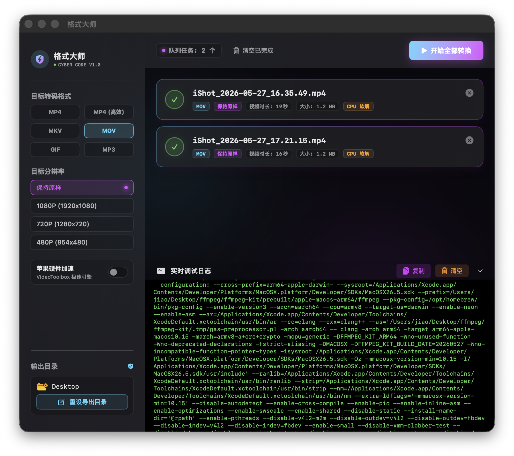
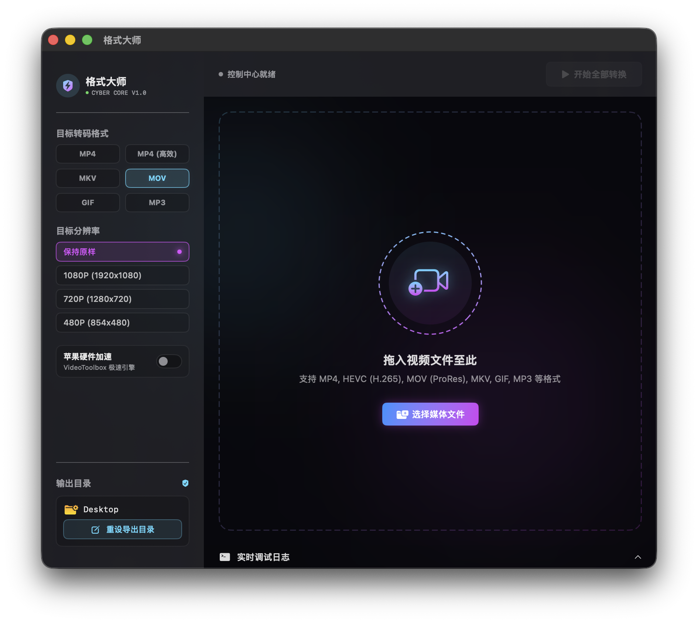

# 🌌 格式大师 (VideoTool) - macOS 极客视频格式转换器

[](https://developer.apple.com/macos/)
[](https://swift.org/)
[](https://developer.apple.com/xcode/swiftui/)
[](https://github.com/ffmpegkit/ffmpeg-kit)
[](https://github.com/realm/SwiftLint)

**格式大师** 是一款为 macOS 专属定制的高性能、极简未来科技感（Cyberpunk / Space-obsidian）的视频与音频格式转换工具。在保持底层 FFmpeg 多线程转码稳定性的同时，我们将视觉设计、控制反馈与沙盒权限管理重构到了极致。

<p align="center">
  
  
</p>

---

## 🎨 视觉系统与科技感 UI (Cyber Design System)

应用界面由原生的 SwiftUI 精雕细琢而成，旨在打造极佳的极客太空舱操作体验：
- **深海极光暗色背景**：底层选用曜石深黑色，搭配高斯模糊高达 `80+` 悬浮的**极客青 (Cyber Cyan) 与迷幻紫 (Neon Purple) 双色极光光晕**，光纤四溢。
- **全息雷达扫描舱**：重新设计的拖拽区自带**周期性旋转的青紫双色虚线全息环**，并伴随温和的呼吸律动，极大增强了人机交互的动态暗示。
- **霓虹毛玻璃卡片**：所有的任务卡片都穿上了带有**极细霓虹渐变描边**的 `.ultraThinMaterial` 玻璃外衣，悬浮立体度拉满。
- **胶囊跑马灯进度条**：使用拼装胶囊渲染的青紫双向流转跑马灯进度条，滑动时在下方投射柔和的紫色溢出阴影。
- **终端风格徽章**：转换格式和分辨率采用等宽字体（Monospaced）渲染的暗色微标签，如 `[ MP4 ]` `[ 1080P ]`，科技仪式感拉满。

---

## ⚡️ 核心产品与技术特性

### 1. 苹果原生硬件加速引擎
- 智能路由 FFmpeg 参数，完美开启 **VideoToolbox 极速编解码**（H.264/HEVC/ProRes），相比传统 CPU 转换提升高达 **3~5 倍**的效率，且大幅降低发热和能耗。
- **智能回退重试**：若检测到运行环境不支持硬件加速，转码器会自动优雅降级至 CPU 兼容的编码器重试，确保 100% 成功输出。

### 2. 沙盒安全特权自愈 (Security-Scoped Bookmark)
- **拦截破解**：macOS 沙盒模式下，拖入或选中的文件在异步线程中其临时特权极易被系统收回。格式大师在用户放入文件的**微秒级同步上下文内**，立刻提取并持久化该文件路径的 **`Security-Scoped Bookmark` (安全范围书签)**。
- **全场景复权**：无论是列表刷新读取物理大小，还是多线程 FFmpeg 底层 C 语言转码读取原片，均自动利用书签令牌进行异步复权，彻底告别“无法读取源文件权限”报错。

### 3. 高性能日志节流与控制台
- 内置 **Double Buffering (双重缓冲节流系统)**。控制台日志通过 `150ms` 频次的节流阀刷新 UI，并对文本溢出长度进行智能裁切，保证在高负荷转码时界面始终维持在极致流畅的 `60 FPS`，解决卡顿隐患。
- 控制台支持**自由选中复制**与**一键清空日志**。

---

## 📂 项目结构指南

```text
VideoTool/
├── VideoTool/                  # 源代码根目录
│   ├── VideoToolApp.swift      # 应用程序入口
│   ├── ContentView.swift       # 曜石极光主视图 & 拖拽交互中心
│   ├── ConvertTask.swift       # 核心转换任务实体 (含物理大小沙盒解析)
│   │
│   ├── ConvertViewModel.swift  # 控制逻辑中枢 (已使用 extension 优化行数规范)
│   ├── VideoConverterEngine.swift # FFmpeg 异步多线程编解码驱动引擎
│   │
│   ├── Views/                  # 视图组件仓
│   │   ├── SettingsSidebar.swift # 极客太空舱控制面板 (网格格式组/拨码 Toggle)
│   │   ├── TaskListView.swift    # 任务列表卡片容器
│   │   ├── TaskCardView.swift    # 转换任务卡片 (含胶囊渐变跑马灯)
│   │   ├── GeekConsoleView.swift # 节流终端调试日志视窗
│   │   └── Common/             # 科技感原子组件 (毛玻璃卡片、呼吸指示灯)
│   │
│   └── Assets.xcassets         # 应用资产库 (含符合 Apple 官方规范的 AppIcon)
│
├── build_dmg.sh                # ⚙️ 极客一键自动化 Release 编译与 DMG 打包脚本
└── ipa/                        # 💿 发布分发目录 (已在 .gitignore 中忽略，存放 .dmg)
```

---

## 🛠 开发者快速启动与一键打包

### 1. 本地运行与开发
用 Xcode 打开目录下的 `VideoTool.xcodeproj` 即可直接编译、调试与运行。

### 2. 静态代码规范核验
项目严格遵守 Apple 的 Swift 代码开发风格，已实现 **`0 warnings, 0 errors` 的 SwiftLint 零警报状态**：
```bash
# 执行本地 Lint 核验
swiftlint
```

### 3. ⚙️ 一键自动化 Release 构建与打包 DMG
我们为您编写了高度自动化的打包工具 [build_dmg.sh](file:///./build_dmg.sh)。
无需在 Xcode 菜单里繁琐地 Archive、导出、挂载软链接。只需在项目根目录下简单执行以下命令：
```bash
./build_dmg.sh
```

**该脚本将全自动为您执行：**
1. **🌪 清理**：自动擦除本地 `build` 编译缓存与旧的 DMG 残留。
2. **🛠 编译**：调用 `xcodebuild` 命令，以 `Release` 模式一键完成高效编译。
3. **📦 装配**：自动建立指向系统 `Applications` 目录的快捷软链接，组装 DMG 分发镜像舱。
4. **💿 归档**：调用 `hdiutil` 将其压缩打包为不可变且超低体积的只读磁盘映像，直接输出到发布目录：`ipa/格式大师.dmg`。
5. **🧹 收尾**：自动回收所有的临时打包和编译物理空间。

---

## 🛡 运行与支持环境
- **操作系统**：macOS 15.0 (Monterey) 及更高版本。
- **架构支持**：Apple Silicon (M1/M2/M3/M4 系列芯片) `arm64` 纯净原生编译。
